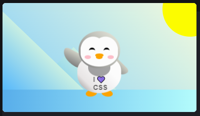

# Note from Victoria

In December 2022, I was curious about software and started [freeCodeCamp's](https://www.freecodecamp.org/) Responsive Web Design course. This project, along with the [Taylor-Swift-Tribute-Page project](https://github.com/victoriamcn/Taylor-Swift-Tribute-Page/tree/main), are apart of that course. Long story short, these projects are what started my tech journey. While I don't update them and they are static one page sites written in vanilla HTML and CSS, I keep them here as a testament to how far I've come.

---

# Penguin Animation Challenge
	
&#128039;
&#x1F427;
&#128075;
&#x1F44B;

## Preview

## Description

This animation was a freeCodeCamp challenge and made 100% with CSS.

## Instructions

You can transform HTML elements to create appealing designs that draw your reader's eye. You can use transforms to rotate elements, scale them, and more. In this course, you'll build a penguin. You'll use CSS transforms to position and resize the parts of your penguin, create a background, and animate your work.

## Badges

